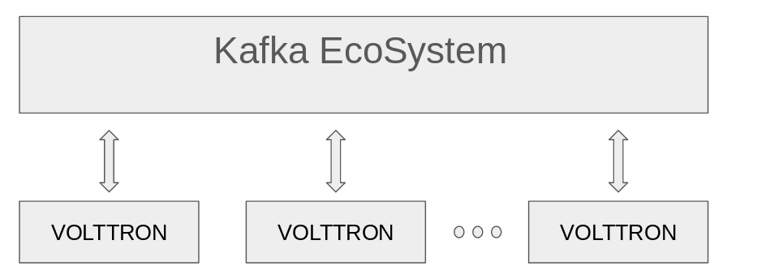
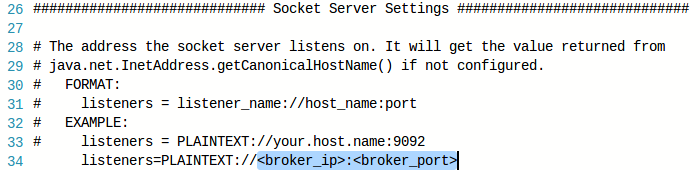
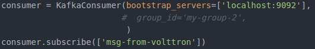
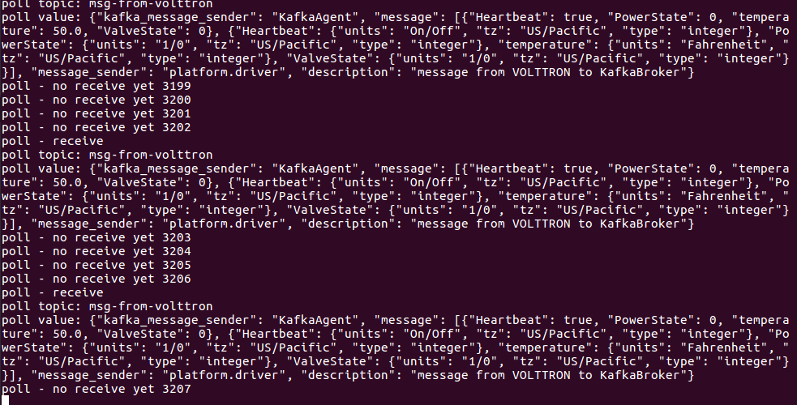
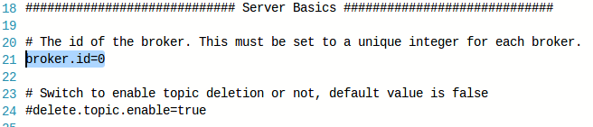

# Kafka Agent

## Test environment & Prerequisties

- Ubuntu 16.04 LTS
- Ubuntu 16.04 LTS mate (for raspberry pi)
- Apache Kafka 0.11.0.1
- [kafka-python](https://github.com/dpkp/kafka-python) 1.3.5


## Overview

Kafka Agent aims to integrate VOLTTRON platform with [Kafka](https://kafka.apache.org/) EcoSystem.


Considering scalability, you can follow the diagram below.




## Features

Subscribe to various data generated by the boltons ("devices", "analysis", "record", "datalogger", "actuators"
-> Kafka producer transfers data to Kafka broker
-> consumer (Maybe application) gets data from the broker.


producer (Maybe application) publishes a message to this broker
-> Consumer of Kafka Agent gets message from broker
-> Publish imported messages to Messagebus


## How to Start

##### Download Kafka - Machine A

<https://www.apache.org/dyn/closer.cgi?path=/kafka/0.11.0.1/kafka_2.11-0.11.0.1.tgz>

```
tar -xzf kafka_2.11-0.11.0.1.tgz
cd kafka_2.11-0.11.0.1
```


##### Start Zookeeper - Machine A

`bin/zookeeper-server-start.sh config/zookeeper.properties`


##### Start Kafka Server(Broker) - Machine A

```
vi config/server.properties
```



set broker ip, broker port (e.g. listeners=PLAINTEXT://127.0.0.1:9092)

```
bin/kafka-server-start.sh config/server.properties
sudo ufw allow 9092
```


##### Install KafkaAgent & Start KafkaAgent 

```
cd volttron/service/contrib/KafkaAgent
vi config
```


kafka_producer_topic: 

The topic that the producer located in Machine A uses to publish messages to the broker.
= The topic used by the consumer located in Machine B (VOLTTRON) to subscribe messages from the broker.


kafka_consumer_topic: 

The topic used by the consumer located in Machine A to subscribe messages from the broker.
= The topic used by the producer located in Machine B (VOLTTRON) to publish messages to the broker.

```
cd volttron
./scripts/core/pack_install.sh service/contrib/KafkaAgent service/contrib/KafkaAgent/config kafkaagent
vctl start <tag or identity of kafkaagent>
```


##### Start Producer(Maybe Application) in Machine A

```
# install kafka-python package
pip install kafka-python
cd Test
vi message.json
```


topic: Topics to be used when KafkaAgent publishes messages from broker to MessageBus inside VOLTTRON

`vi kafka_producer.py`


`python kafka_producer.py ` 


##### Start Consumer(Maybe Application) in Machine B

`vi kafka_consumer.py`






### More Details

If you run more than one broker, you need to have a different broker_id.

