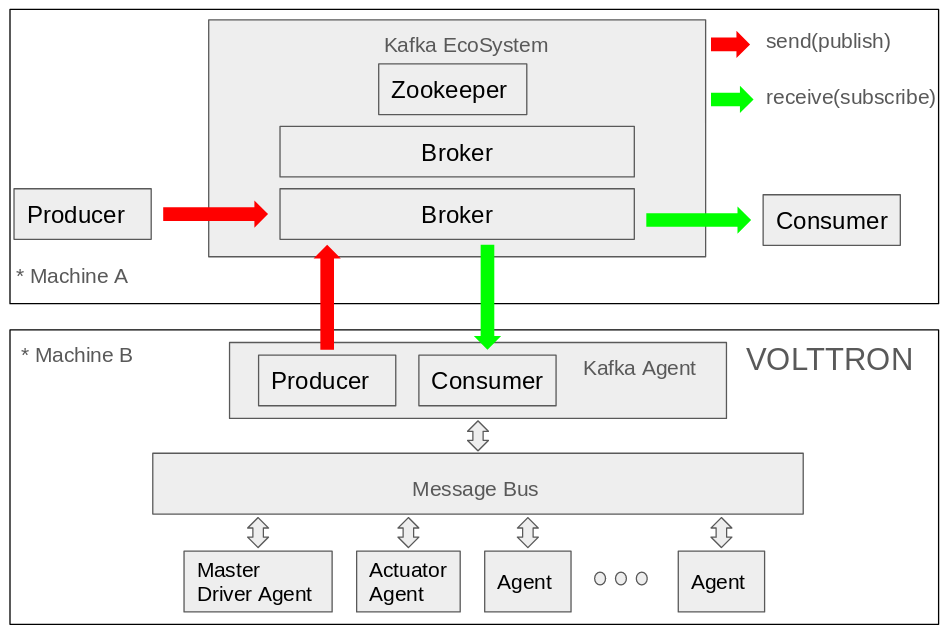
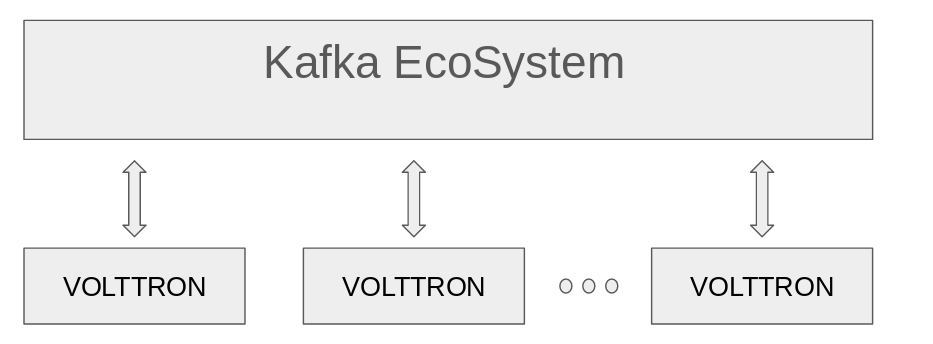
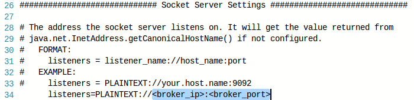
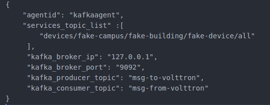
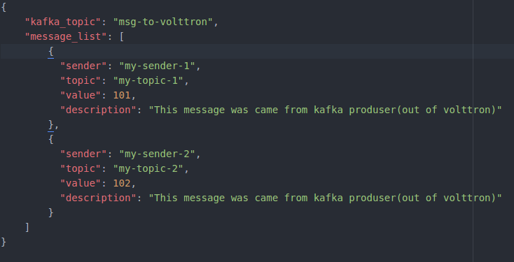
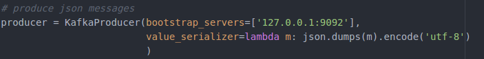
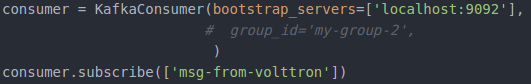
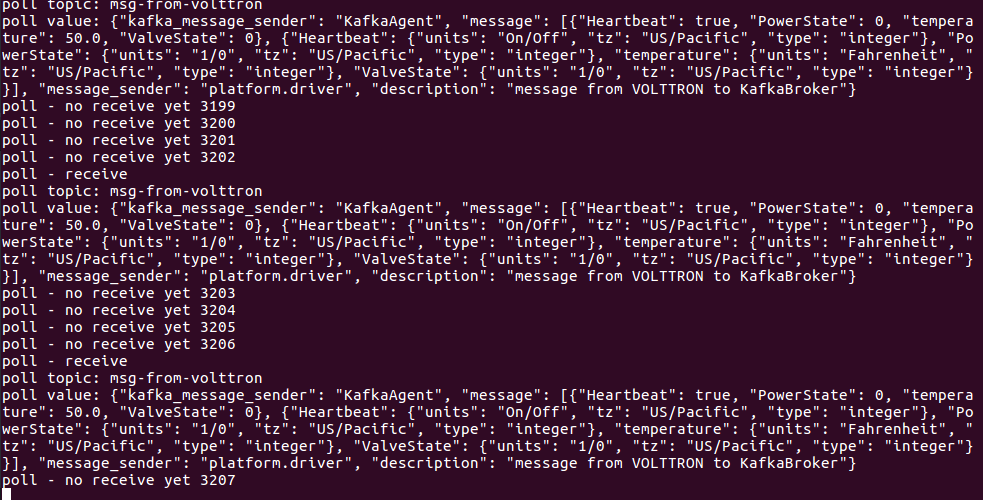
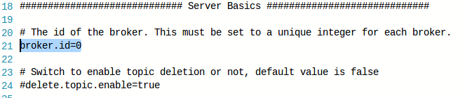

.. header-n0:

Kafka Agent
===========

.. header-n2:

Test environment & Prerequisties
--------------------------------

-  Ubuntu 16.04 LTS

-  Ubuntu 16.04 LTS mate (for raspberry pi)

-  Apache Kafka 0.11.0.1

-  `kafka-python <https://github.com/dpkp/kafka-python>`__ 1.3.5

.. header-n17:

Overview
--------

Kafka Agent aims to integrate VOLTTRON platform with
`Kafka <https://kafka.apache.org/>`__ EcoSystem.

Considering scalability, you can follow the diagram below.

.. header-n30:

Features
--------

Subscribe to various data generated by the boltons ("devices",
"analysis", "record", "datalogger", "actuators" -> Kafka producer
transfers data to Kafka broker -> consumer (Maybe application) gets data
from the broker.

producer (Maybe application) publishes a message to this broker ->
Consumer of Kafka Agent gets message from broker -> Publish imported
messages to Messagebus

.. header-n43:

How to Start
------------

.. header-n44:

Download Kafka - Machine A
~~~~~~~~~~~~~~~~~~~~~~~~~~

https://www.apache.org/dyn/closer.cgi?path=/kafka/0.11.0.1/kafka_2.11-0.11.0.1.tgz

.. code:: 

    tar -xzf kafka_2.11-0.11.0.1.tgz
    cd kafka_2.11-0.11.0.1

.. header-n50:

Start Zookeeper - Machine A
~~~~~~~~~~~~~~~~~~~~~~~~~~~

``bin/zookeeper-server-start.sh config/zookeeper.properties``

.. header-n55:

Start Kafka Server(Broker) - Machine A
~~~~~~~~~~~~~~~~~~~~~~~~~~~~~~~~~~~~~~

.. code:: 

    vi config/server.properties

set broker ip, broker port (e.g. listeners=PLAINTEXT://127.0.0.1:9092)

.. code:: 

    bin/kafka-server-start.sh config/server.properties
    sudo ufw allow 9092

.. header-n64:

Install KafkaAgent & Start KafkaAgent
~~~~~~~~~~~~~~~~~~~~~~~~~~~~~~~~~~~~~

.. code:: 

    cd volttron/service/contrib/KafkaAgent
    vi config

kafka_producer_topic:

The topic that the producer located in Machine A uses to publish
messages to the broker. = The topic used by the consumer located in
Machine B (VOLTTRON) to subscribe messages from the broker.

kafka_consumer_topic:

The topic used by the consumer located in Machine A to subscribe
messages from the broker. = The topic used by the producer located in
Machine B (VOLTTRON) to publish messages to the broker.

.. code:: 

    cd volttron
    
    # using install-agent.py (Recommended)
    python ./scripts/install-agent.py -s services/contrib/KafkaAgent/ -c services/contrib/KafkaAgent/config [-t TAG]
    
    # using pack_install.sh
    ./scripts/core/pack_install.sh service/contrib/KafkaAgent service/contrib/KafkaAgent/config kafkaagent
    vctl start <tag or identity of kafkaagent>

.. header-n83:

Start Producer(Maybe Application) in Machine A
~~~~~~~~~~~~~~~~~~~~~~~~~~~~~~~~~~~~~~~~~~~~~~

.. code:: 

    # install kafka-python package
    pip install kafka-python
    cd Test
    vi message.json

topic: Topics to be used when KafkaAgent publishes messages from broker
to MessageBus inside VOLTTRON

``vi kafka_producer.py``

``python kafka_producer.py``

.. figure:: ./img/how_to_start_5.png
   :alt: 

.. header-n99:

Start Consumer(Maybe Application) in Machine B
~~~~~~~~~~~~~~~~~~~~~~~~~~~~~~~~~~~~~~~~~~~~~~

``vi kafka_consumer.py``

.. header-n108:

More Details
~~~~~~~~~~~~

If you run more than one broker, you need to have a different broker_id.

