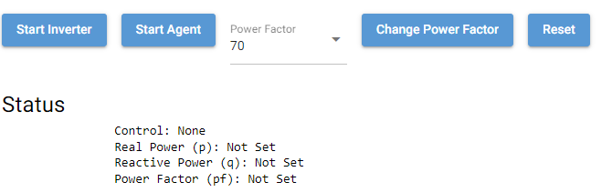
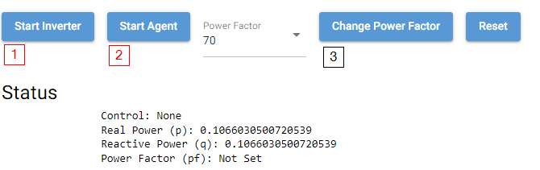
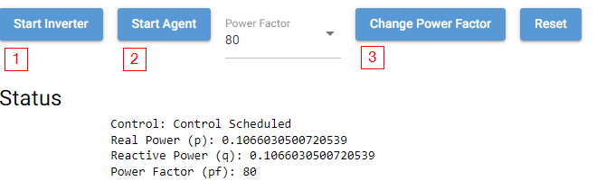
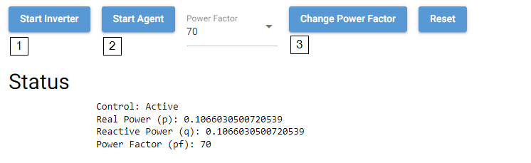
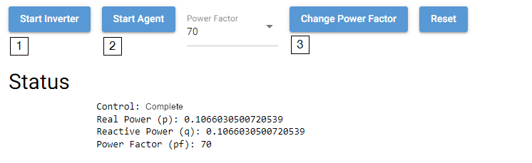

# 2030.5 Agent Demo

This readme walks through a demo of an inverter publishing points to the VOLTTRON message bus where the 2030.5 agent will receive it.  The 2030.5 agent will then create MirrorUsagePoints and POST MirrorMeterReadings to the 2030.5 server.  In addition, the demo will also allow the user to create a DERControl event.  During the activation of the event, the agent will log messages to the 2030.5 server.

The demo will require three terminal windows to be open.  The first will be for executing the main VOLTTRON process.  The second will be for executing the 2030.5 server.  The third will be for executing the agent demo through a web interface.  For the rest of this document, VOLTTRON_ROOT is assumed to be where one has cloned the volttron repository.

First configure the server then the VOLTTRON instance and findally the web based demo.

## 2030.5 Server

For the server software we will be using a server from a team at PNNL.  The GridAPPS-D team has created a 2030.5 server and it is available at <https://pypi.org/project/gridappsd-2030-5/>.  The source code is still in a private repo, but will be released at some time in the future.

1. In a new terminal create a new virtual environment and install the gridappsd server.  **This directory should be outside the main volttron tree**

    ```bash
    > mkdir 2030_5_server
    > cd 2030_5_server

    # creates an environment 'env' in the current directory
    > python3 -m venv serverenv

    > source serverenv/bin/activate

    (serverenv)> pip install gridappsd-2030-5
    ```

1. The server is now installed.  Next copy the openssl.cnf and server.yml file from the $VOLTTRON_ROOT/services/core/IEEE_2030_5/demo directory to the newly created 2030_5_server directory.  After copying the current directory should look like the following.

    ```bash
    (serverenv)> ls -l
        serverenv
        openssl.cnf
        server.yml
    ```

1. Modify the openssl.cnf to include the correct values for [req_distinguished_name].  Or use the defaults.  The server will create self-signed certificates for the client to use.

1. Modify the server.yml file.  The default server.yml file contains a device (id: dev1) and DERProgram.  **dev1 must be present for the demo to run smoothly.**

1. Start the server from the activated serverenv **This step will create development certificates for you**.  By default the certificates will be generated and stored in ~/tls.  One can change this location in the server.yml configuration file.

    ```bash
    (serverenv)> 2030_5_server server.yml --no-validate

    # without creating certificates
    # (serverenv)> 2030_5_server server.yml --no-validate --no-create-certs
    ```

## Demo Requirements

For this demo, start a VOLTTRON default instance from the command line.  The following command will start VOLTTRON in the background writing to a volttron.log file.

1. Activate and start the volttron instance.

    ```bash
    > cd $VOLTTRON_ROOT
    > source env/bin/activate
    (volttron)> ./start-volttron
    # Watch the volttron log
    (volttron)> tail -f volttron.log
    ```

1. Open another terminal to start the demo server in.  

    ```bash
    > cd $VOLTTRON_ROOT
    > source env/bin/activate
    (volttron)> cd service/core/IEEE_2030_5
    (volttron)> pip install -r requirements_demo.txt
    ...
    ```

1. Create an agent keypair for the 2030.5 agent to use (only needed for demo in real mode installing the agent would create this).

    ```bash
    (volttron)> vctl keypair > demo/keypair.json
    (volttron)> cat demo/keypair.json
    {
      "public": "YrRnX1ifv5hkctAtNsLMut1j3qr7dPf0gppvwH_53wE",
      "secret": "C55SSFUKAM38dXZKjMSolRvFVfILbSTF9JkUQWlP8II"
    }
    ```

1. Add the publickey to VOLTTRON auth mechanism

    ```bash
    (volttron)> vctl auth add --credentials "YrRnX1ifv5hkctAtNsLMut1j3qr7dPf0gppvwH_53wE" --user_id inverter1
    ```

1. Run the webgui.py script using the python interpretor.  This should open a webpage allowing one to test the functionality of the 2030.5 agent.  By default it will open at <http://0.0.0.0:8080>.

    ```bash
    (volttron)> python demo/webgui.py
    ```

## The Demo

The initial demo screen.



Clicking on the Start Inverter and Start Agent buttons the status of Real and Reactive power should update based upon what is posted to the MirrorUsagePoints.



Changing the power factor to 80 and clicking on the Change Power Factor button (3) will show the scheduling, activating and completion of the event.






