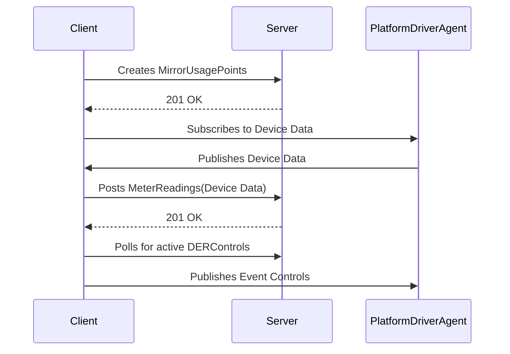
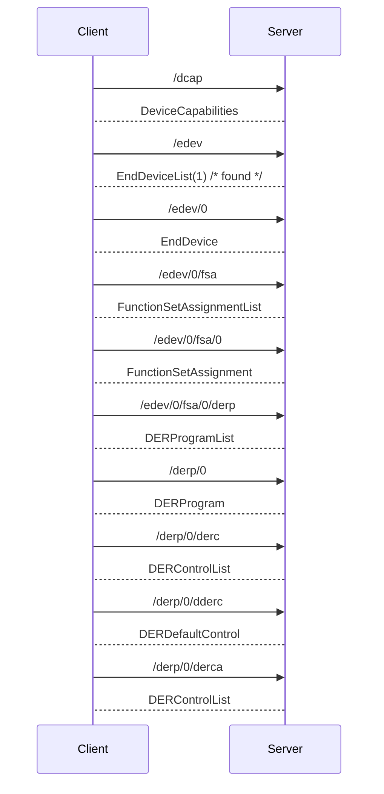

# VOLTTRON 2030.5 Agent

The VOLTTRON 2030.5 agent communicates with a 2030.5 server using the IEEE 2030.5(2018) protocol.  The primary concern of
this agent is to handle the communication between the PlatformDriverAgent and the 2030.5 server.  The agent will create MirrorUsagePoints and readings to the 2030.5 server and send control actions to the message bus during DERControl events.

The following diagram illistrates the data flow for the 2030.5 agent from the PlatformDriverAgent to the 2030.5 server.



To better visualize how this works please try out the [Agent Demo](AGENT_DEMO.md).

## Agent Config File

An example configuration file is at the root of the agent directory (example.config.yml)

```yaml
# required parameters
# A host ip address or a resolvable dns entry is required for connecting to.
# The agent will connect to this during the startup of the agent.
server_hostname: 127.0.0.1

# The client and ca paramenters are required for bi-directional
# verification of certificates/keys.
cacertfile: ~/tls/certs/ca.pem
keyfile: ~/tls/private/dev1.pem
certfile: ~/tls/certs/dev1.pem

# the pin number is used to verify the server is the correct server
pin: 111115

# SSL defaults to 443
server_ssl_port: 8443

# The following is the definition of the MirrorUsagePoints
MirrorUsagePointList:
  # MirrorMeterReading based on Table E.2 IEEE Std 2030.5-18
  # note the mRID in the MirrorMeterReading is the same that is in the
  #      MirrorUsagePoint.
  # 
  # NOTE: The subscription point will be a member of an "all" message from
  #       the PlatformDriverAgent.
  - subscription_point: p_ac
    mRID: 5509D69F8B3535950000000000009182
    description: DER Inverter Real Power
    roleFlags: 49
    serviceCategoryKind: 0
    status: 0
    MirrorMeterReading:
      mRID: 5509D69F8B3535950000000000009182
      description: Real Power(W) Set
      ReadingType:
        accumulationBehavior: 12
        commodity: 1
        dataQualifier: 2
        intervalLength: 300
        powerOfTenMultiplier: 0
        uom: 38
  # NOTE: The subscription point will be a member of an "all" message from
  #       the PlatformDriverAgent.
  - subscription_point: q_ac
    mRID: 5509D69F8B3535950000000000009184
    description: DER Inverter Reactive Power
    roleFlags: 49
    serviceCategoryKind: 0
    status: 0
    MirrorMeterReading:
      mRID: 5509D69F8B3535950000000000009184
      description: Reactive Power(VAr) Set
      ReadingType:
        accumulationBehavior: 12
        commodity: 1
        dataQualifier: 2
        intervalLength: 300
        powerOfTenMultiplier: 0
        uom: 38

# publishes on the following subscriptions will
# be available to create and POST readings to the
# 2030.5 server.
subscriptions:
  - devices/inverter1/all
```

## Agent Installation

The 2030.5 agent can be installed using an activated terminal from the root of the volttron git repository:

```bash
(volttron)>vctl install service/core/IEEE_2030_5 --agent-config example.config.yml --vip-identity inverter1
```

## 2030.5 Protocol

The 2030.5 protocol uses a
REQUEST/RESPONSE pattern meaning that all communication with the 2030.5 server will start with a REQUEST being sent
from the client.

### Communication

The 2030.5 protocol starts with requests to the server for determining the DERProgram and DERControl that the client should be using.  Once the default and scheduled DERControls are known then the client can act according to the 2030.5 server's requirements.

The following diagram illistrates the request and response from the client to the server.



After the DERControls are found the client needs to poll the server for updates.  Depending on the function set, the poll rate could be different.  

## GridAPPSD 2030.5 Server

## Demo
