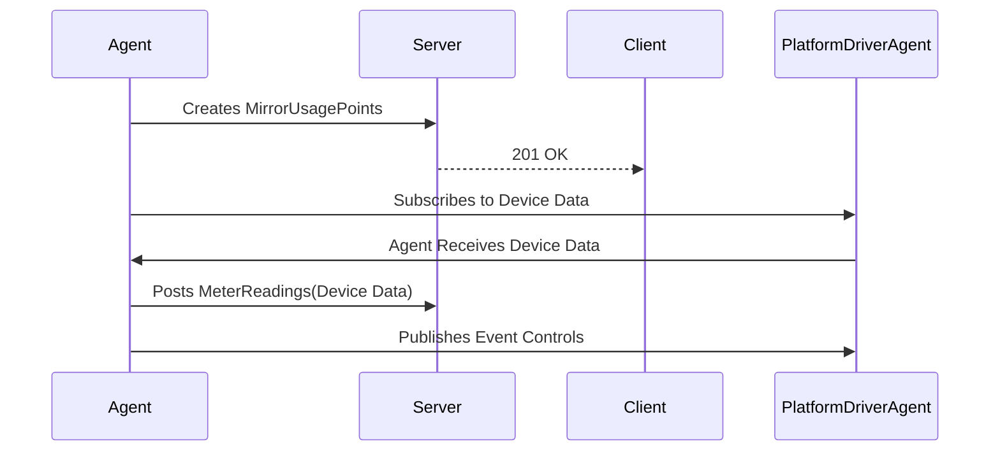
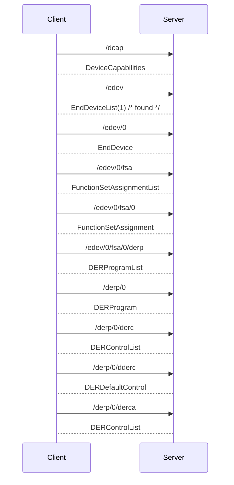

# VOLTTRON 2030.5 Agent #

The VOLTTRON 2030.5 agent facilitates communication between the PlatformDriverAgent and a 2030.5
server, using the IEEE 2030.5(2018) protocol. The agent's primary role is to manage data exchange
between the PlatformDriverAgent and the 2030.5 server. It creates MirrorUsagePoints and readings on
the 2030.5 server and dispatches control actions to the message bus during DERControl events.

The following diagram illustrates the data flow for the 2030.5 agent, from the PlatformDriverAgent to the 2030.5 server:



To see this process in action, please try out the [Agent Demo](AGENTDEMO.md).

## Agent Config File ##

An example configuration file is at the root of the agent directory (example.config.yml)

```yaml
# These are required in order for the agent to connect to the server.
cacertfile: ~/tls/certs/ca.crt
keyfile: ~/tls/private/dev1.pem
certfile: ~/tls/certs/dev1.crt
server_hostname: 127.0.0.1

# the pin number is used to verify the server is the correct server
pin: 111115

# Log the request and responses from the server.
log_req_resp: true

# SSL defaults to 443
server_ssl_port: 8443

# Number of seconds to poll for new default der settings.
default_der_control_poll: 10

MirrorUsagePointList:
  # MirrorMeterReading based on Table E.2 IEEE Std 2030.5-18
  - device_point: INV_REAL_PWR
    mRID: 5509D69F8B3535950000000000009182
    description: DER Inverter Real Power
    roleFlags: 49
    serviceCategoryKind: 0
    status: 0
    MirrorMeterReading:
      mRID: 5509D69F8B3535950000000000009183
      description: Real Power(W) Set
      ReadingType:
        accumulationBehavior: 12
        commodity: 1
        dataQualifier: 2
        intervalLength: 300
        powerOfTenMultiplier: 0
        uom: 38
  - device_point: INV_REAC_PWR
    mRID: 5509D69F8B3535950000000000009184
    description: DER Inverter Reactive Power
    roleFlags: 49
    serviceCategoryKind: 0
    status: 0
    MirrorMeterReading:
      mRID: 5509D69F8B3535950000000000009185
      description: Reactive Power(VAr) Set
      ReadingType:
        accumulationBehavior: 12
        commodity: 1
        dataQualifier: 2
        intervalLength: 300
        powerOfTenMultiplier: 0
        uom: 38

# publishes on the following subscriptions will
# be available to create and POST readings to the
# 2030.5 server.
device_topic: devices/inverter1

# Nameplate ratings for this der client will be put to the
# server during startup of the system.
DERCapability:
  # modesSupported is a HexBinary31 representation of DERControlType
  # See Figure B.34 DER info types for information
  # conversion in python is as follows
  #   "{0:08b}".format(int("500040", 16))
  #   '10100000000000001000000'  # This is a bitmask
  # to generate HexBinary
  #   hex(int('10100000000000001000000', 2))
  #   0x500040
  modesSupported: 500040
  rtgMaxW:
    multiplier: 0
    value: 0
  type: 0

DERSettings:
  modesEnabled: 100000
  setGradW: 0
  setMaxW:
    multiplier: 0
    value: 0

# Note this file MUST be in the config store or this agent will not run properly.
point_map: config:///inverter_sample.csv
```

See the [inverter_sample.csv](inverter_sample.csv) file.

In the inverter_sample.csv file we have columns such as the following excerpt.  The Point Name
corresponds to an all message published to the device_topic.  Only the points with both the
Parameter Type and the Point Name are used when publshing/setting points to the platform.driver.

| Point Name             | Description       | Multiplier | MRID | Offset | Parameter Type                              | Notes                                             |
|------------------------|-------------------|------------|------|--------|---------------------------------------------|---------------------------------------------------|
| ctrl_connected         |                   |            |      |        | DERControlBase::opModConnect                | True/False Connected = True, Disconnected = False |
| ctrl_energized         |                   |            |      |        | DERControlBase::opModEnergize               | True/False Energized = True, De-Energized = False |
| ctrl_fixed_pf_absorb_w |                   |            |      |        | DERControlBase::opModFixedPFAbsorbW         |                                                   |
|------------------------|-------------------|------------|------|--------|---------------------------------------------|---------------------------------------------------|

## Agent Installation ##

The 2030.5 agent can be installed and started using an activated terminal from the root of the volttron
git repository. Here are the steps:

1. Open a terminal and navigate to the root of the volttron git repository.

    ```bash
    cd /path/to/volttron
    ```

1. Activate the virtual environment for volttron.

    ```bash
    source env/bin/activate
    ```

1. Update the config store for the 2030.5 agent.  Note we use the identity inverter1

   ```bash
   vctl config store 'inverter1' 'inverter_sample.csv' 'services/core/IEEE_2030_5/inverter_sample.csv' --csv
   ```

1. Install and start the 2030.5 agent using the `vctl` command. The `--start` option starts the agent
   immediately after installation. The `--agent-config` option specifies the configuration file for
   the agent. The `--vip-identity` option sets the identity of the agent on the VOLTTRON message bus.

    ```bash
    vctl install services/core/IEEE_2030_5 --start --agent-config services/core/IEEE_2030_5/example.config.yml --vip-identity inverter1
    ```

This completes the installation and startup of the 2030.5 agent.

## 2030.5 Protocol ##

The 2030.5 protocol uses a
REQUEST/RESPONSE pattern meaning that all communication with the 2030.5 server will start with a
REQUEST being sent from the client.

### Communication ###

The 2030.5 protocol starts with requests to the server for determining the DERProgram and DERControl
that the client should be using.  Once the default and scheduled DERControls are known then the
client can act according to the 2030.5 server's requirements.

The following diagram illistrates the request and response from the client to the server.



After the DERControls are found the client needs to poll the server for updates.  Depending on the
function set, the poll rate could be different.

## Agent Limitations ##

This agent is not a fully compliant 2030.5 client, meaning it does not support all of the function sets
within the 2030.5 standard.  It provides the following function sets:

- End Device
- Time
- Distributed Energy Resources
- Metering
- Metering Mirror

As time goes on it is likely that this list will be extended through user support.
