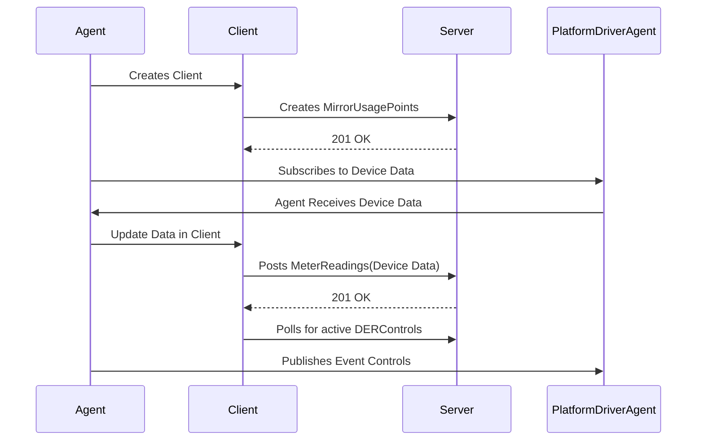

# VOLTTRON 2030.5 Agent

The VOLTTRON 2030.5 agent communicates with a 2030.5 server using the IEEE 2030.5(2018) protocol.  The primary concern of
this agent is to handle the communication between the PlatformDriverAgent and the 2030.5 server.  The agent will create MirrorUsagePoints and readings to the 2030.5 server and send control actions to the message bus during DERControl events.

The following diagram illistrates the data flow for the 2030.5 agent from the PlatformDriverAgent to the 2030.5 server.



To see this process in action, please try out the [Agent Demo](AGENT_DEMO.md).

## Agent Config File

<details>
<summary>An example configuration file is at the root of the agent directory (example.config.yml)</summary>

```yaml
# required parameters
cacertfile: ~/tls/certs/ca.crt
keyfile: ~/tls/private/dev1.pem
certfile: ~/tls/certs/dev1.crt
server_hostname: 127.0.0.1
# the pin number is used to verify the server is the correct server
pin: 111115

# Log the request and responses from the server.
log_req_resp: true

# SSL defaults to 443
server_ssl_port: 8443
# http port defaults to none
#server_http_port: 8080
# Number of seconds to poll for new default der settings.
default_der_control_poll: 60

MirrorUsagePointList:
  # MirrorMeterReading based on Table E.2 IEEE Std 2030.5-18
  # note the mRID in the MirrorMeterReading is the same that is in the
  #      MirrorUsagePoint.
  - subscription_point: p_ac
    mRID: 5509D69F8B3535950000000000009182
    description: DER Inverter Real Power
    roleFlags: 49
    serviceCategoryKind: 0
    status: 0
    MirrorMeterReading:
      mRID: 5509D69F8B3535950000000000009182
      description: Real Power(W) Set
      ReadingType:
        accumulationBehavior: 12
        commodity: 1
        dataQualifier: 2
        intervalLength: 300
        powerOfTenMultiplier: 0
        uom: 38
  - subscription_point: q_ac
    mRID: 5509D69F8B3535950000000000009184
    description: DER Inverter Reactive Power
    roleFlags: 49
    serviceCategoryKind: 0
    status: 0
    MirrorMeterReading:
      mRID: 5509D69F8B3535950000000000009184
      description: Reactive Power(VAr) Set
      ReadingType:
        accumulationBehavior: 12
        commodity: 1
        dataQualifier: 2
        intervalLength: 300
        powerOfTenMultiplier: 0
        uom: 38

# publishes on the following subscriptions will
# be available to create and POST readings to the
# 2030.5 server.
subscriptions:
  - devices/inverter1/all

# Nameplate ratings for this der client will be put to the
# server during startup of the system.
DERCapability:
  # modesSupported is a HexBinary31 representation of DERControlType
  # See Figure B.34 DER info types for information
  # conversion in python is as follows
  #   "{0:08b}".format(int("500040", 16))
  #   '10100000000000001000000'  # This is a bitmask
  # to generate HexBinary
  #   hex(int('10100000000000001000000', 2))
  #   0x500040
  modesSupported: 500040
  rtgMaxW:
    multiplier: 0
    value: 0
  type: 0

DERSettings:
  modesEnabled: 100000
  setGradW: 0
  setMaxW:
    multiplier: 0
    value: 0

# Note this file MUST be in the config store or this agent will not run properly.
point_map: config:///inverter_sample.csv
```
</details>

## Agent Installation

The 2030.5 agent can be installed and started using an activated terminal from the root of the volttron git repository:

```bash
vctl install services/core/IEEE_2030_5 --start --agent-config services/core/IEEE_2030_5/example.config.yml --vip-identity inverter1
```

## 2030.5 Protocol

The 2030.5 protocol uses a
REQUEST/RESPONSE pattern meaning that all communication with the 2030.5 server will start with a REQUEST being sent
from the client.

### Communication

The 2030.5 protocol starts with requests to the server for determining the DERProgram and DERControl that the client should be using.  Once the default and scheduled DERControls are known then the client can act according to the 2030.5 server's requirements.

The following diagram illistrates the request and response from the client to the server.


After the DERControls are found the client needs to poll the server for updates.  Depending on the function set, the poll rate could be different.  

## GridAPPSD 2030.5 Server

## Demo
