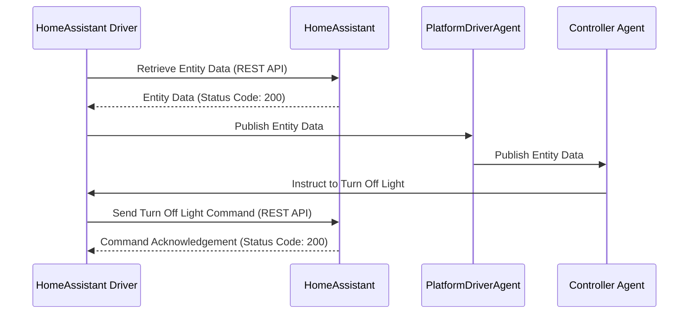

**VOLTTRON Home Assistant Driver.** 

Please see the README for the platform driver.
[services/core/PlatformDriverAgent/README.md](https://github.com/riley206/Rileys_volttron/blob/55146b78d3ab7f53d08598df272cdda2d0aa8d3d/services/core/PlatformDriverAgent/README.md)

The first thing you will need is your Home Assistant IP address and your long lived access token. Instructions here https://developers.home-assistant.io/docs/auth_api/#long-lived-access-token


Next, you can clone the repository, install the listener agent, and the platform driver agent.

Listener agent: https://volttron.readthedocs.io/en/main/introduction/platform-install.html#installing-and-running-agents

Platform driver agent: https://volttron.readthedocs.io/en/main/agent-framework/core-service-agents/platform-driver/platform-driver-agent.html?highlight=platform%20driver%20isntall#configuring-the-platform-driver

Once you have cloned the repo, fill out your configuration files. Each device will have 2. Make sure your registry_config points to your devices registry file from the config store.

**light.example.config**
```json
{
    "driver_config": {
        "ip_address": "Your Home Assistant IP",
        "access_token": "Your Home Assistant Access Token",
        "volttron_topic": "your volttron topic",
        "port": "Your Port"
    },
    "driver_type": "home_assistant",
    "registry_config":"config://light.example.json",
    "interval": 30,
    "timezone": "UTC"
}
```
Your register file will contain one device, with the ability to add attributes. Entity ID is used to extract data from Home Assistant, and Volttron Point Name will get the state or attributes defined. In this example, the file name is light.example.json

**light.example.json**
```json
[
    {
        "Entity ID": "light.example",
        "Volttron Point Name": "state",
        "Units": "On / Off",
        "Units Details": "on/off",
        "Writable": true,
        "Starting Value": true,
        "Type": "boolean",
        "Notes": "lights hallway"
    },
    {
        "Entity ID": "light.example",
        "Volttron Point Name": "brightness",
        "Units": "int",
        "Units Details": "light level",
        "Writable": true,
        "Starting Value": 0,
        "Type": "int",
        "Notes": "brightness control, 0 - 255"
    }
]
```
Attributes can be found in developer tools or by opening the device in the GUI of Home Assistant. 


Add the registers files and the config files into the VOLTTRON config store. 


```bash
vctl config store platform.driver light.example.json HomeAssistant_Driver/light.example.json

vctl config store platform.driver devices/BUILDING/ROOM/light.example HomeAssistant_Driver/light.example.config
```


Once this is complete you should be able to start the platform driver. Use the listener agent to validate the driver output. 
```log
2023-09-12 11:37:00,226 (listeneragent-3.3 211531) __main__ INFO: Peer: pubsub, Sender: platform.driver:, Bus: , Topic: devices/BUILDING/ROOM/light.example/all, Headers: {'Date': '2023-09-12T18:37:00.224648+00:00', 'TimeStamp': '2023-09-12T18:37:00.224648+00:00', 'SynchronizedTimeStamp': '2023-09-12T18:37:00.000000+00:00', 'min_compatible_version': '3.0', 'max_compatible_version': ''}, Message: 
[{'brightness': 254, 'state': 'on'},
 {'brightness': {'type': 'integer', 'tz': 'UTC', 'units': 'int'},
  'state': {'type': 'integer', 'tz': 'UTC', 'units': 'On / Off'}}]
```