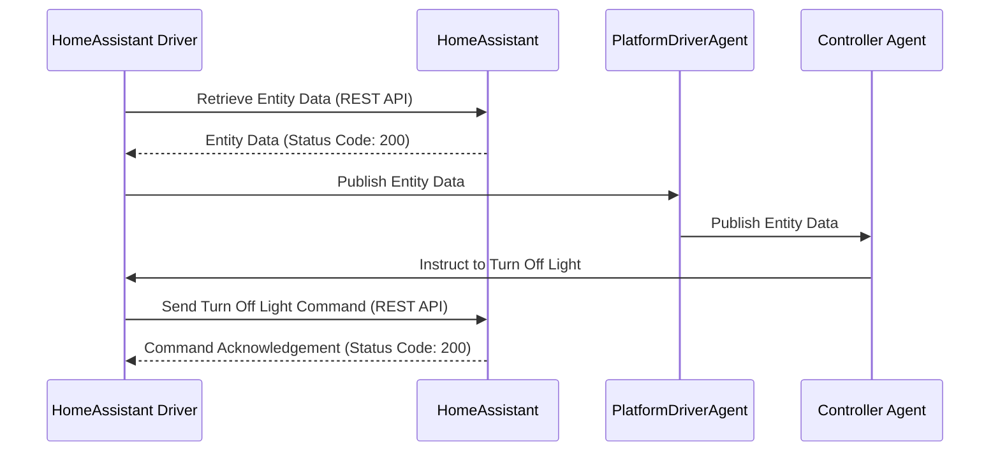

**VOLTTRON Home Assistant Driver.** 

The Home Assistant driver provides VOLTTRON with a way to access any point of data from a home assistant device. It currently allows for control of lights and thermostats. 

Please see the README for the platform driver.
[services/core/PlatformDriverAgent/README.md](https://github.com/riley206/Rileys_volttron/blob/55146b78d3ab7f53d08598df272cdda2d0aa8d3d/services/core/PlatformDriverAgent/README.md)

The first thing you will need is your Home Assistant IP address and your long lived access token. Instructions here https://developers.home-assistant.io/docs/auth_api/#long-lived-access-token


Next, you can clone the repository, install the listener agent, and the platform driver agent.

Listener agent: https://volttron.readthedocs.io/en/main/introduction/platform-install.html#installing-and-running-agents

Platform driver agent: https://volttron.readthedocs.io/en/main/agent-framework/core-service-agents/platform-driver/platform-driver-agent.html?highlight=platform%20driver%20isntall#configuring-the-platform-driver

Once you have cloned the repo, fill out your configuration files. Each device/entity will have 1 configuration file. Each set of homogenous devices such as lights will share one registry file.

For example below we have two seperate lights.

**lights**
```json
{
    "driver_config": {
        "ip_address": "Your Home Assistant IP address",
        "access_token": "Your Access Token",
        "port": "Your port",
        "entity_id": "light.example"
    },
    "driver_type": "home_assistant",
    "registry_config":"config://lights.json",
    "interval": 30,
    "timezone": "UTC"
}
```
```json
{
    "driver_config": {
        "ip_address": "Your Home Assistant IP address",
        "access_token": "Your Access Token",
        "port": "Your port",
        "entity_id": "light.example2"
    },
    "driver_type": "home_assistant",
    "registry_config":"config://lights.json",
    "interval": 30,
    "timezone": "UTC"
}
```
Both light.example and light.example2 will share this registry file below. Light states are currently converted to integers with 0 being off and 1 being on.  

**lights.json**
```json
[
    {
        "Volttron Point Name": "state",
        "Units": "On / Off",
        "Units Details": "0: off, 1: on",
        "Writable": true,
        "Starting Value": true,
        "Type": "int",
        "Notes": "state control"
    },
    {
        "Volttron Point Name": "brightness",
        "Units": "int",
        "Units Details": "0-255 light level",
        "Writable": true,
        "Starting Value": 0,
        "Type": "int",
        "Notes": "brightness control"
    }
]
```
**Thermostats**

For thermostats the state is also converted into numbers. "1: Off, 2: heat, 3: Cool, 4: Auto".
```json
[
    {
        "Entity ID": "climate.my_thermostat",
        "Volttron Point Name": "state",
        "Units": "int",
        "Units Details": "0: Off, 2: heat, 3: Cool, 4: Auto",
        "Writable": true,
        "Starting Value": 1,
        "Type": "int",
        "Notes": "Mode of the thermostat"
    },
    {
        "Entity ID": "climate.my_thermostat",
        "Volttron Point Name": "current_temperature",
        "Units": "F",
        "Units Details": "Current Ambient Temperature",
        "Writable": true,
        "Starting Value": 72,
        "Type": "float",
        "Notes": "Current temperature reading"
    },
    {
        "Entity ID": "climate.my_thermostat",
        "Volttron Point Name": "temperature",
        "Units": "F",
        "Units Details": "Desired Temperature",
        "Writable": true,
        "Starting Value": 75,
        "Type": "float",
        "Notes": "Target Temp"
    }
]
```
Attributes can be found in developer tools in the GUI of Home Assistant. 


**Add to config store**

Add the registers files and the config files into the VOLTTRON config store. 


```bash
vctl config store platform.driver lights.json PATH/TO/lights.json

vctl config store platform.driver devices/BUILDING/ROOM/light.example PATH/TO/light.example.config

vctl config store platform.driver devices/BUILDING/ROOM/light.example2 PATH/TO/light.example2.config
```


Once this is complete you should be able to start the platform driver. Use the listener agent to validate the driver output. 
```log
2023-09-12 11:37:00,226 (listeneragent-3.3 211531) __main__ INFO: Peer: pubsub, Sender: platform.driver:, Bus: , Topic: devices/BUILDING/ROOM/light.example/all, Headers: {'Date': '2023-09-12T18:37:00.224648+00:00', 'TimeStamp': '2023-09-12T18:37:00.224648+00:00', 'SynchronizedTimeStamp': '2023-09-12T18:37:00.000000+00:00', 'min_compatible_version': '3.0', 'max_compatible_version': ''}, Message: 
[{'brightness': 254, 'state': 'on'},
 {'brightness': {'type': 'integer', 'tz': 'UTC', 'units': 'int'},
  'state': {'type': 'integer', 'tz': 'UTC', 'units': 'On / Off'}}]
```