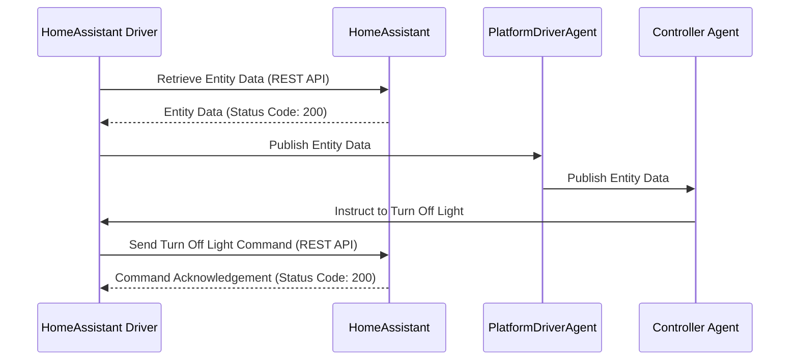

**VOLTTRON Home Assistant Driver.** 

Please see the README for the platform driver.
[services/core/PlatformDriverAgent/README.md](https://github.com/riley206/Rileys_volttron/blob/55146b78d3ab7f53d08598df272cdda2d0aa8d3d/services/core/PlatformDriverAgent/README.md)

The first thing you will need is the IP address and your long lived access token from your Home Assistant instance. 
In the Home Assistant ui you can click on your profile picture and scroll all the way down to find your long lived access token. 


Next, you can either clone this repository as is, or manually grab the three files necessary to add to your VOLTTRON instance.

The three files you will need are HomeAssistant_Driver/home_assistant.config, HomeAssistant_Driver/home_assistant_registers.json, and services/core/PlatformDriverAgent/platform_driver/interfaces/home_assistant.py

Once you have these files in the same place (or you just cloned this) you can add what you need to the config file and the registers file. The config file stores your IP address, your port, and your access token from Home Assistant. If you would like to send data from VOLTTRON to Home Assistant, you can change "devices/fake-device/all" to whatever device running in VOLTTRON. You can then add the points in the points_to_grab_from_topic. This will take point values from devices running in VOLTTRON and send them to Home Assistant. If you do not want anything to be sent you can leave default or leave blank.

For example if you are running the fake driver in VOLTTRON and want to send data, the volttron_topic would be "devices/fake-device/all" and you can grab points such as EKG and EKG_Cos to send to Home Assistant.

```json
{
    "driver_config": {
        "ip_address": "Your Home Assistant IP",
        "access_token": "Your Home Assistant Access Token",
        "volttron_topic": "devices/fake-device/all",
        "points_to_grab_from_topic": ["EKG", "EKG_Cos"],
        "port": "Your Home Assistant Port"
    },
    "driver_type": "home_assistant",
    "registry_config":"config://home_assistant_registers.json",
    "interval": 30,
    "timezone": "UTC"
}
```
Your register file will contain the entities along with their attributes. For devices with no attributes lets say for example a humidity sensor, this driver will label the humidity as state since its the only value being pulled. If you would like to change this to another value you can add the attribute state_replace and the name of what it should be. For example "state_replace": "humidity". Since this sensor only pulls one value it will replace state: 50% with humidity: 50%.

```json
    {
        "Point Name": "sensor.average_humidity_1621",
        "Volttron Point Name": "sensor.average_humidity_1621",
        "Units": "%",
        "Units Details": "%",
        "Writable": true,
        "Starting Value": 20,
        "Type": "float",
        "Notes": "Average humidity of 1621",
        "Attributes": {
            "state_replace": "humidity"
        }
    },
```

Other devices such as thermostats will have multiple attributes, simply add the attributes in the attributes field so we can keep values the same. 

```json
    {
        "Point Name": "climate.thermostat",
        "Volttron Point Name": "climate.thermostat",
        "Units": "C",
        "Units Details": "C",
        "Writable": true,
        "Starting Value": true,
        "Type": "boolean",
        "Notes": "lights bedroom",
        "Attributes": {
            "temperature": "current_temperature",
            "humidity": "current_humidity"
        }
    },
```
For example, let's consider a thermostat with an attribute called "current_temperature" in Home Assistant. In order to keep data continuity and ensure consistency, we can map this attribute to the key "temperature" in VOLTTRON. This means that in VOLTTRON the attribute will show as "temperature" while it actually corresponds to the attribute "current_temperature" in Home Assistant. 

Attributes can be found in developer tools or by opening the device in the GUI of Home Assistant. 


We are now ready to get the driver running. Right now you can install the listener agent and a historian if you are looking to store data and view in VOLTTRON. Install the platform driver and make sure the home_assistant.py is in the interfaces folder. 

Add the registers file and the config file into the VOLTTRON config store. 

here are examples:  vctl config store platform.driver home_assistant_registers.csv HomeAssistant_Driver/home_assistant_registers.json --json
                    vctl config store platform.driver devices/fakedevice examples/configurations/driver/fake.config

Once this is complete you should be able to start the platform driver and tail the volttron log to see the devices being pulled in from Home Asssistant. 

**VOLTTRON Home Assistant Driver - Code.**

Pulling Data from Home Assistant:

Pulling data from Home Assistant is managed by the get_entity_data function, which is called within the _scrape_all function. The get_entity_data function starts by creating the headers used for the REST API which includes your access token for authorization. We then create the URL with the last segment of the URL being the entitiy_id we have retireved through the registers file. This will grab the JSON data about that entity and return the response. 

```python
    def _scrape_all(self):
        result = {}
        read_registers = self.get_registers_by_type("byte", True)
        write_registers = self.get_registers_by_type("byte", False)

        def get_entity_data(entity_id):
            headers = {
                "Authorization": f"Bearer {self.access_token}",
                "Content-Type": "application/json",
            }
            url = f"http://{self.ip_address}:{self.port}/api/states/{entity_id}" # the /states grabs cuurent state AND attributes of a specific entity
            response = requests.get(url, headers=headers)
            if response.status_code == 200:
                return response.json() # return the json attributes from entity
            else:
                _log.error(f"Request failed with status code {response.status_code}: {entity_id} {response.text}")
                return None
```

Next, we loop through the read and write registers, which contain the entity IDs. We assign entity_id to our point names and attributes to attributes. Lastly, entity_data is assigned as the function is called to pass the entity data we got from the API into the entity_data variable. 

```python
        for register in read_registers + write_registers:
            
            entity_id = register.point_name
            attributes = register.attributes
            entity_data = get_entity_data(entity_id) # assign arrtributes to entity_data  
```

**Controlling Entities**

Controlling Home Assistant entities happens in the parse_config method.

As before, we need to create headers and a URL for use. This time we use light/turn_on at the end of the URL, the "light" is the domain and "turn_on" is the service. You can read more here https://developers.home-assistant.io/docs/api/rest/ 

Next, we add the entity_id and brightness in the payload to add it to our response, we also use requests.post rather than requests.get. 
When we call the function, it will turn on all the lights and set the brightness. Control for the thermostats is pretty much the same. 

We also assume that light entities start with "light" since in Home Assistant all light entites will indeed start with the string light. This allows us to only send controls for lights rather than sending the turn_on service to other devices. The same has been done for thermostats. 

```python
        def turn_on_lights(brightness_level):
            url2 = f"http://{self.ip_address}:{self.port}/api/services/light/turn_on"
            
            headers = {
                    "Authorization": f"Bearer {self.access_token}",
                    "Content-Type": "application/json",
                }
            point_names = point_name.split('\n')
            for entity in point_names:
                if entity.startswith("light"): # this will ensure that only lights are conrolled and not other devices
                    try:
                     # ranges from 0 - 255 for most lights
                        payload = {
                            "entity_id": f"{entity}",
                            "brightness": brightness_level,
                        }
                        response = requests.post(url2, headers=headers, data=json.dumps(payload))
                        if response.status_code == 200:
                            _log.info(f"Turned on {entity}")
                    except:
                        continue
                else:
                    continue
```

**Sending Data from VOLTTRON**

Sending data to Home Assistant from VOLTTRON happens in the _create_subscriptions and the _handle_publish functions. 

```python
    def _create_subscriptions(self, topic):
        """
        Unsubscribe from all pub/sub topics and create a subscription to a topic in the configuration which triggers
        the _handle_publish callback
        """
        self.vip.pubsub.unsubscribe("pubsub", None, None)

        self.vip.pubsub.subscribe(peer='pubsub',
                                  prefix=topic,
                                  callback=self._handle_publish)    
    def _handle_publish(self, peer, sender, bus, topic, headers, message):
        for value in self.points_to_grab_from_topic:
            for element in message:
                if value in element:
                    data1 = json.dumps(element[f"{value}"]) #data 1 is the json dump of the member from member as a string
                    _log.info(f"Matching Value Found: {value} with data: {data1}")
                    url = f"http://{self.ip_address}:{self.port}/api/states/sensor.{value}"
                    headers = {
                        "Authorization": f"Bearer {self.access_token}",
                        "Content-Type": "application/json",
                    }                 
                    data2 = f'{{"state": {data1}}}'
                    try: # it wont connect and wont throw a status code if you are on the wrong network or have the wrong ip. 
                        response = requests.post(url, headers=headers, data=data2) # posted data to HA is data2. maybe create a try
                        if response.status_code == 200:
                            _log.info(f"----------Sent {data2} from {value} successfully----------")
                        else:
                            _log.info(f"Failed to send {data2} to Home Assistant")
                    except requests.exceptions.ConnectionError as e:
                        _log.info(f"\n-----Connection Error, make sure you are on the same network as home assistant and have correct IP----- {e}\n")
                    break
                else:
                    _log.error(f"{value} not in {element}")
            else:        
                _log.error(f"{element} not in {message}")
```

This code subscribes to the device specified in the config file, then loops through the points in the device and the point specified in the config. If the value is in the element, meaning if the point in the config is one of the points on the device, it will send the data of that point to Home Assistant and create a new sensor with the name of the point as the name of the sensor in home assistant. For example, if you add EKG as a point and its in the fake driver, then you will have a new sensor in Home Assistant called sensor.ekg with the values of ekg. 