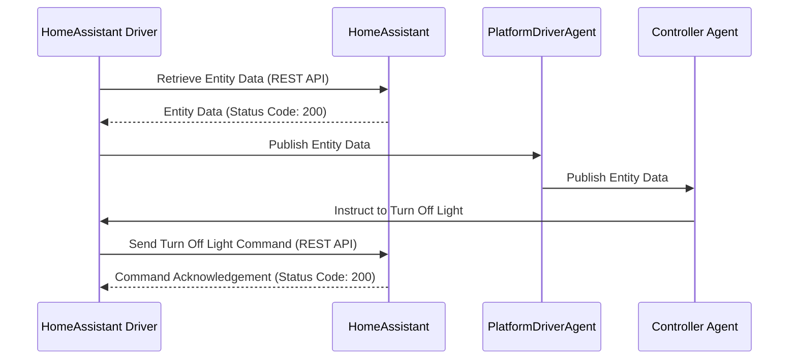

**Volttron Home Assistant Driver.** 

Please see the README for the platfrom driver.
[services/core/PlatformDriverAgent/README.md](https://github.com/riley206/Rileys_volttron/blob/55146b78d3ab7f53d08598df272cdda2d0aa8d3d/services/core/PlatformDriverAgent/README.md)

The first thing you will need is the IP address and your long lived access token from your home assistant instance. 
In the Home Assistant ui you can click on your profile picture and scroll all the way down to find your long lived access token. 


Next you can clone this repo as is or you can manually grab the three files necessary to add to your VOLTTRON instance. 

The three files you will need are HomeAssistant_Driver/home_assistant.config, HomeAssistant_Driver/home_assistant_registers.json, and services/core/PlatformDriverAgent/platform_driver/interfaces/home_assistant.py

Once you have these files in the same place (or you just cloned this) you can add what you need to the config file and the registers file. The config file stores your IP address and your access token from Home Assistant. If you would like to send data from VOLTTRON to home assistant you can change the devices/fake-device/all to whatever device running in VOLTTRON. You can then add the points in the points_to_grab_from_topic. This will take point values from devices running in volttron and send them to home assistant. If you do not want anything to be sent you can leave default or leave blank.

For example if you are running the fake driver in VOLTTRON and want to send data, the volttron_topic would be "devices/fake-device/all" and you can grab points such as EKG and EKG_Cos to send to Home Assistant.
```json
{
    "driver_config": {
        "ip_address": "your home assistant ip address",
        "access_token": "your home assistant access token",
        "volttron_topic": "devices/fake-device/all",
        "points_to_grab_from_topic": ["EKG", "EKG_Cos"]
    },
    "driver_type": "home_assistant",
    "registry_config":"config://home_assistant_registers.json",
    "interval": 30,
    "timezone": "UTC"
}
```
You register file will contain the entities along with their attributes. For devices with no attributes lets say for example a humidity sensor, this driver will label the humidity as state since its the only value being pulled. If you would like to change this to another value you can add the attribute state_replace and the name of what it should be. For example "state_replace": "humidity". Since this sensor only pulls one value it will replace state: 50% with humidity: 50%.

```json
    {
        "Point Name": "sensor.average_humidity_1621",
        "Volttron Point Name": "sensor.average_humidity_1621",
        "Units": "%",
        "Units Details": "%",
        "Writable": true,
        "Starting Value": 20,
        "Type": "float",
        "Notes": "Average humidity of 1621",
        "Attributes": {
            "state_replace": "humidity"
        }
    },
```

Other devices such as thermostats will have multiple attributes, simply add the attributes in the attributes field so we can keep values the same. 

```json
    {
        "Point Name": "climate.thermostat",
        "Volttron Point Name": "climate.thermostat",
        "Units": "C",
        "Units Details": "C",
        "Writable": true,
        "Starting Value": true,
        "Type": "boolean",
        "Notes": "lights bedroom",
        "Attributes": {
            "temperature": "current_temperature",
            "humidity": "current_humidity"
        }
    },
```
For example, let's consider a thermostat with an attribute called "current_temperature" in Home Assistant. In order to keep data continuity and ensure consistency, we can map this attribute to the key "temperature" in VOLTTRON. This means that in VOLTTRON the attribute will show as "temperature" while it actually corresponds to the attribute "current_temperature" in Home Assistant. 

Attributes can be found in devloper tools or by opening the device in the GUI of Home Assistant. 


We are now ready to get the driver running. Right now you can install the listener agent and a historian if you are looking to store data and view in VOLTTRON. Install the platform driver and make sure the home_assistaht.py is in the interfaces folder. 

Add the registers file and the config file into the VOLTTRON config store. 

here are examples:  vctl config store platform.driver home_assistant_registers.csv HomeAssistant_Driver/home_assistant_registers.json --json
                    vctl config store platform.driver devices/fakedevice examples/configurations/driver/fake.config

Once this is compelte you should be able to start the platform driver and tail the volttron log to see the devices being pulled in form home asssistant. 
